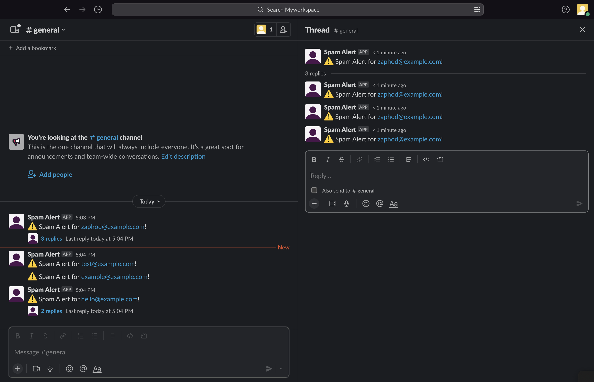

# Slack Alert



Create a web endpoint that accepts a JSON payload as a POST request and sends an alert to a Slack channel if the payload matches desired criteria
 
- The alert is sent to the Slack channel only if the payload is a spam notification.
- The Slack alert includes the email address included in the payload

## Project Setup
git clone git@github.com:Soumya0803/Slack-Alert.git

###  Virtual environment
Create virtual environment
`python -m venv Slackalert`
Activate virtual environment
`. Slackalert/bin/activate`

### Requirements
Install with 
`pip install -r requirements.txt`
OR
Install inividually 

```
pip install Flask
pip install python-dotenv
pip install slack_sdk   
pip install Flask-Caching 
pip install gunicorn 
```
 
# Start app
There are two app impelementations:
**slack_alert**: Uses Slack WebClient to send notification in slack. Notifications are threaded based on the email. The thread_ts for parent message is cached with email as key.

*Slack requirements*
- Create an App for your workspace
- In OAuth & Permissions set Bot Token Scopes to chat:write
- Set the environment variables for SLACK_BOT_TOKEN, CHANNEL_ID

`flask --app slack_alert run`

**slack_alert_webhook**: Uses webhook to send notification in Slack.

*Slack requirements*
- Create an App for your workspace if it is not created
- Activate Incoming Webhooks in your Slack App
- Add new webhook for your channel by selecting
- Set the environment variables for SLACK_WEBHOOK_URL in .env file

`flask --app slack_alert_webhook run`

After starting the flask app send a JSON payload as a POST request to the endpoint http://localhost:5000/ using Postman. 

Example payloads:
A spam report that should result in an alert
```
{
  "RecordType": "Bounce",
  "Type": "SpamNotification",
  "TypeCode": 512,
  "Name": "Spam notification",
  "Tag": "",
  "MessageStream": "outbound",
  "Description": "The message was delivered, but was either blocked by the user, or classified as spam, bulk mail, or had rejected content.",
  "Email": "zaphod@example.com",
  "From": "notifications@honeybadger.io",
  "BouncedAt": "2023-02-27T21:41:30Z"
}
```

A payload that should not result in an alert
```
{
  "RecordType": "Bounce",
  "MessageStream": "outbound",
  "Type": "HardBounce",
  "TypeCode": 1,
  "Name": "Hard bounce",
  "Tag": "Test",
  "Description": "The server was unable to deliver your message (ex: unknown user, mailbox not found).",
  "Email": "arthur@example.com",
  "From": "notifications@honeybadger.io",
  "BouncedAt": "2019-11-05T16:33:54.9070259Z",
}
```

### Deployment 
Start the application with Gunicorn
`gunicorn -w 4 'slack_alert:app'`

